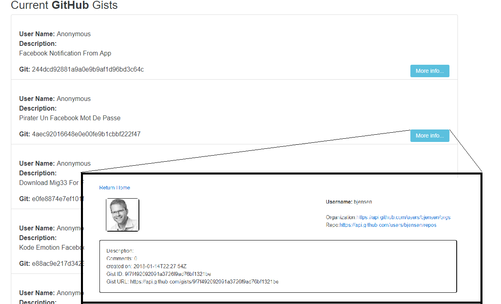

# Simple Gist Viewer
This is a simple repo that I created for fun leverages github's gist API:

```
https://developer.github.com/v3/gists/
```

Uses React Router to navigate between list and detail views, just playing around with stuff.

```
npm install
npm run dev
```


